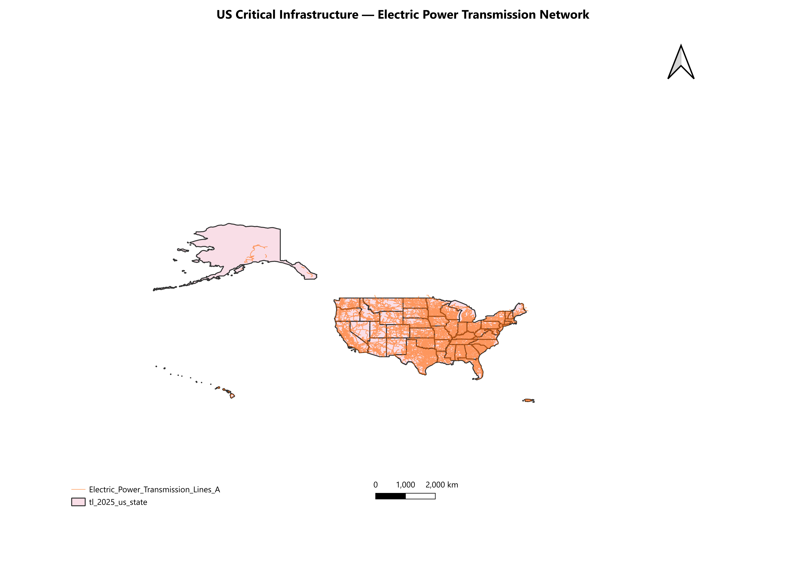
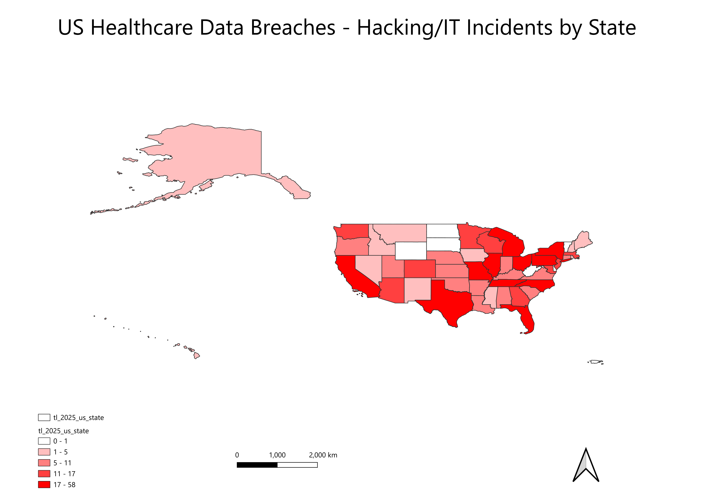
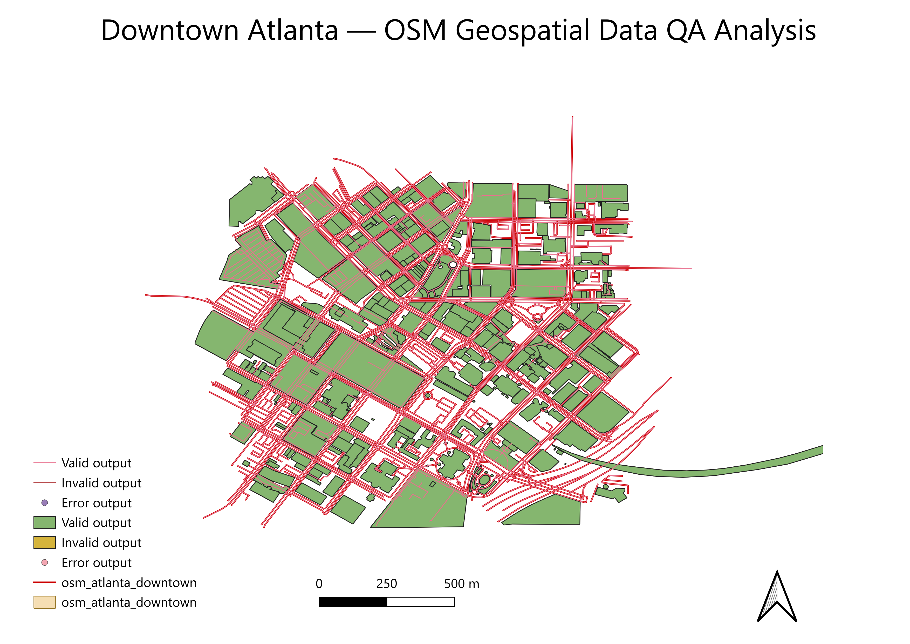

# Geospatial Analysis Portfolio — Rashidah Carr

**QGIS | Critical Infrastructure | Cybersecurity | AI Data Quality**

[](https://linkedin.com/in/rashidahcarr)
[](mailto:rcarr@the97group.com)

---

## About This Portfolio

This repository documents geospatial analysis projects built with QGIS, developed at the intersection of **cybersecurity, critical infrastructure, and AI data quality**. Each project applies GIS methodology to real-world public datasets, with an emphasis on data integrity, annotation accuracy, and actionable visual outputs.

**Background:** I bring 20+ years of experience in cybersecurity, data architecture, and AI governance, including work supporting CISA/DHS, ISC2 exam development, and AI/ML data annotation. This portfolio bridges that domain expertise with geospatial analysis tools and techniques.

---

## Projects

| # | Project | Focus Area | Key Skills |
|---|---------|------------|------------|
| 01 | [Critical Infrastructure Sector Mapping](#project-01) | CISA / National Security | Layer styling, public data ingestion, choropleth maps |
| 02 | [Cybersecurity Incident Heatmap](#project-02) | Breach data visualization | Heatmaps, state-level aggregation, data cleaning |
| 03 | [Geospatial Data QA for AI Training](#project-03) | AI/ML data quality | Feature annotation, QA documentation, error flagging |

---

## Project 01

### Critical Infrastructure Sector Mapping
> *Visualizing the geographic distribution of US critical infrastructure using public CISA data*

**Objective:** Map and analyze the physical distribution of critical infrastructure assets across CISA's 16 designated sectors, identifying geographic concentration and coverage gaps relevant to national security planning.

**Data Sources:**
- [US Census Bureau TIGER/Line Shapefiles 2025](https://www.census.gov/cgi-bin/geo/shapefiles/index.php) — state boundaries base layer
- [HIFLD Open Data — Electric Power Transmission Lines](https://hifld-geoplatform.hub.arcgis.com/) — Energy sector
- [HIFLD Open Data — Hospitals 2020](https://hifld-geoplatform.hub.arcgis.com/) — Health & Public Health sector
- [EIA Natural Gas Inter/Intrastate Pipelines](https://www.eia.gov/maps/layer_info-m.php) — Energy sector

**Methodology:**
1. Ingested 2025 US Census TIGER state boundary shapefiles as the base layer (EPSG:4326)
2. Loaded and styled three CISA sector infrastructure layers:
   - Electric power transmission lines (Energy sector) — orange, 0.3mm stroke, 40% opacity
   - Natural gas inter/intrastate pipelines (Energy sector) — yellow, 0.2mm stroke, 30% opacity
   - HIFLD hospital locations (Health & Public Health sector) — red points, 0.8mm size, 70% opacity
3. Ordered layers by geometry type (points above lines above polygons) for optimal readability
4. Created print layout with title, legend, scale bar, and north arrow
5. Exported at 300 DPI in PNG and PDF formats

**Key Findings:**
- Electric power transmission and natural gas pipeline networks show highest density in the eastern US, particularly along the Gulf Coast and Mid-Atlantic corridors
- Hospital distribution closely mirrors population density, with notable gaps in rural western states indicating potential healthcare access vulnerabilities
- Energy infrastructure concentration in the Southeast aligns with CISA threat modeling priorities for grid resilience
- Alaska shows meaningful infrastructure presence across all three sectors despite its geographic isolation

**Tools Used:** QGIS 3.x, HIFLD Open Data, EIA Pipeline Data, US Census TIGER/Line Shapefiles 2025

**Files:**
```
project-01-critical-infrastructure/
├── data/               # Source shapefiles and CSV inputs (see data/README.md for sources)
├── maps/               # Exported PNG and PDF map outputs
└── docs/               # Methodology notes and field mapping documentation
```

**Map Preview:**



---

## Project 02

### Cybersecurity Incident Heatmap
> *State-level visualization of reported healthcare data breaches using HHS public breach data*

**Objective:** Transform publicly reported cybersecurity breach data into a geographic heatmap to identify regional vulnerability patterns and support risk-based resource prioritization.

**Data Sources:**
- [HHS Office for Civil Rights Breach Portal](https://ocrportal.hhs.gov/ocr/breach/breach_report.jsf) — HIPAA breach report, breaches affecting 500+ individuals
- US Census Bureau TIGER/Line Shapefiles 2025 — state boundaries

**Methodology:**
1. Downloaded HIPAA breach report CSV from HHS OCR portal (725 total records)
2. Pre-processed data using Python (pandas) — filtered to hacking/IT incidents (614 records), aggregated by state
3. Loaded US state boundary shapefile and HHS aggregated CSV into QGIS
4. Performed attribute join between state shapefile and breach data on state abbreviation field (STUSPS)
5. Exported joined layer as GeoPackage to make join permanent
6. Created numeric field using Field Calculator (`to_int()`) to enable graduated symbology
7. Applied Equal Count (Quantile) choropleth classification across 5 break points using Reds color ramp
8. Added state boundary layer on top with transparent fill and dark gray stroke for readability
9. Created print layout with title, legend, scale bar, and north arrow
10. Exported at 300 DPI in PNG and PDF formats

**Key Findings:**
- California leads with 58 hacking/IT incidents affecting over 15 million individuals
- Florida and Texas tied at 45 incidents each, reflecting large healthcare network exposure
- Missouri reported only 18 incidents but over 9.7 million individuals affected, indicating one or more large-scale breaches
- North Dakota, Vermont, and West Virginia reported zero hacking/IT breaches of 500+ individuals in the dataset
- US territories (American Samoa, Guam, CNMI, Puerto Rico, US Virgin Islands) also reported no incidents, likely reflecting reporting gaps rather than absence of breaches
- Eastern US states show consistently higher breach density, aligning with higher population and healthcare infrastructure concentration

**Tools Used:** QGIS 3.x, Python (pandas), HHS OCR HIPAA Breach Data, US Census TIGER/Line Shapefiles 2025

**Files:**
```
project-02-cybersecurity-incident-heatmap/
├── data/               # HHS breach CSVs, state shapefiles, GeoPackage with joined data
├── maps/               # Choropleth map exports (PNG and PDF)
└── docs/               # Python pre-processing script and methodology notes
```

**Map Preview:**



---

## Project 03

### Geospatial Data QA for AI Training
> *Simulating a geospatial data annotation and quality assurance workflow for AI/ML model training*

**Objective:** Demonstrate a structured QA process for geospatial training data — identifying labeling inconsistencies, flagging problematic features, and documenting corrections in a format suitable for AI model refinement pipelines.

**Background:** This project directly mirrors real-world AI data annotation workflows. Drawing on my experience as an AI Data Annotator at RWS and my work with CISA training content, this project applies those QA principles to geospatial feature data.

**Data Sources:**
- OpenStreetMap export via [Overpass Turbo](https://overpass-turbo.eu/) — building footprints and road networks for downtown Atlanta, GA
- Bounding box: 33.748, -84.395 to 33.758, -84.383 (downtown Atlanta core)

**Methodology:**
1. Exported downtown Atlanta OSM data using Overpass Turbo with building, highway, and landuse filters
2. Loaded GeoJSON into QGIS as two separate geometry layers: Polygon (430 features) and LineString (1693 features)
3. Ran geometry validity checks on both layers using QGIS Vector > Geometry Tools > Check Validity (GEOS 3.14.1)
4. Performed systematic attribute completeness audit across key fields: building, name, landuse, building:use, building:material, building:levels
5. Identified and categorized QA issues: missing attributes, generic labels, systematic nulls, and landuse gaps
6. Documented all findings in structured QA log CSV with feature ID, issue type, action taken, and confidence score
7. Styled layers and exported print-ready map layout at 300 DPI

**QA Issue Categories Identified:**

| Issue Type | Count | Description |
|------------|-------|-------------|
| Missing attributes | 3+ | NULL building type or name on mapped polygons |
| Generic labels | ~60% of polygons | `building=yes` with no specific type classification |
| Systematic nulls | 3 fields | `building:colour`, `building:material`, `building:use` empty across all 430 polygons |
| Road attribute gaps | Majority of lines | Lane markings, directional lane data absent across linestring layer |
| Landuse gaps | Multiple | `landuse` NULL for institutional and mixed-use polygons |
| Geometry errors | 0 | All 430 polygons and 1693 linestrings passed validity check |

**Key Findings:**
- All 2123 features passed GEOS geometry validity checks -- no topology errors detected
- Approximately 60% of building polygons carry only a generic `building=yes` tag with no specific use classification, significantly limiting their utility for AI training datasets
- Three critical attribute fields (`building:colour`, `building:material`, `building:use`) are entirely unpopulated across the full polygon dataset
- Road network data shows systematic gaps in directional lane attributes, limiting use for autonomous vehicle training applications
- Named landmarks (CNN Center, Hurt Building, Georgia State University buildings) are well-attributed compared to unnamed structures, creating uneven data quality across the dataset

**Tools Used:** QGIS 4.x, Overpass Turbo, Python (json), GEOS 3.14.1 Geometry Validator

**Files:**
```
project-03-geospatial-data-qa/
├── data/               # OSM GeoJSON export for downtown Atlanta
├── maps/               # QA map exports (PNG and PDF)
└── docs/               # qa_log.csv with 15 documented findings
```

**Map Preview:**



---

## Technical Skills Demonstrated

| Skill | Projects |
|-------|---------|
| Shapefile ingestion and layer management | 01, 02, 03 |
| Attribute table joins | 01, 02 |
| Choropleth and graduated symbology | 01, 02 |
| Heatmap / density visualization | 02 |
| Topology checking and geometry validation | 03 |
| Feature annotation and QA documentation | 03 |
| Print layout and map export | 01, 02, 03 |
| Python pre-processing (pandas) | 02 |
| Public data sourcing (CISA, HHS, OSM, USGS) | 01, 02, 03 |

---

## Domain Expertise

This portfolio is informed by professional experience across:

- **Critical Infrastructure Security** — Cybersecurity Instructor/Technical Lead, Edgesource supporting CISA/DHS
- **AI Data Quality** — AI Data Annotator, RWS (machine learning dataset annotation)
- **Risk and Compliance** — CISSP, CySA+, ISO 27001/42001 Lead Auditor; NIST, GDPR, HIPAA frameworks
- **Data Architecture** — Data Architect, Delaware North America; master data governance and migration

---

## Contact

**Rashidah Carr**
Cybersecurity | AI Governance | Geospatial Analysis
Atlanta, GA
rcarr@the97group.com | 973.704.8317
[the97group.com](https://the97group.com)
